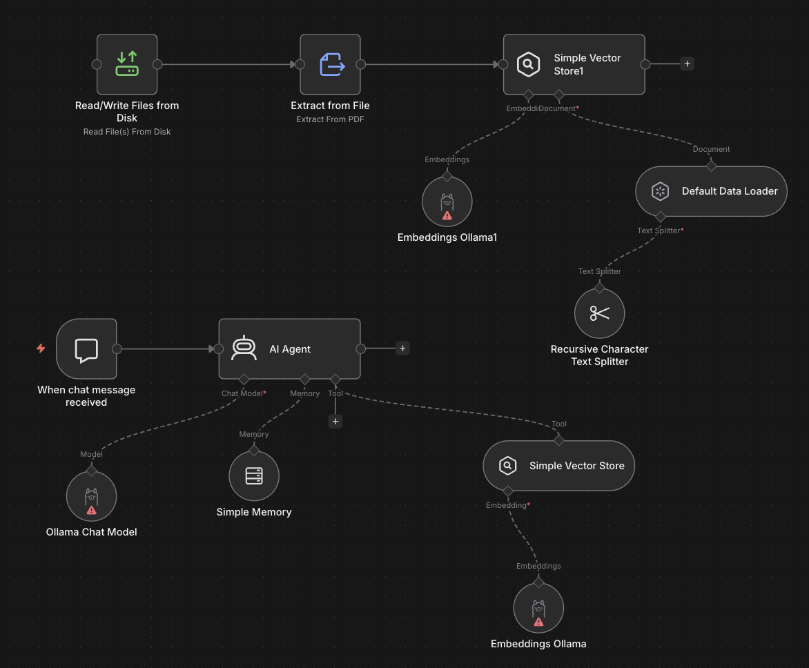
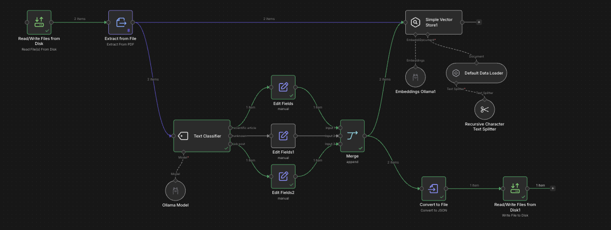

## RAG worflow

### basic rag architecture



### text classifier for document ingestion




## Setup n8n and ollama (with GPU) in docker

setup n8n
```bash
docker-compose up -d
```

start ollama on host
```bash
ollama serve
```

list chat/embedding models
```bash
ollama list
```

open `http://localhost:5678/home/workflows` drag rag template from `/template` into canvas and start chatting.

Make sure ollama has the right models in use.

